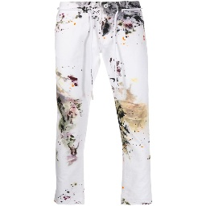
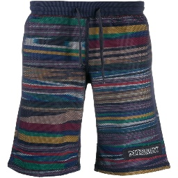

#简介
---
这是一个简单的使用rensnet、vgg等backbone network实现的衣服分类模型。衣服类别为5类：jeans, shorts, sweater, trousers, t-shirts。训练数据为4977张256*256分辨率的衣服图片，示例图片如下图所示。保存验证集预测准确率最高的模型参数。

训练及验证图片分别存在"./dataset/plan/man/xxclothes"中，训练集、验证集图片路径及标签存在"./data/train.npy(or val.npy)"中。

<table>
    <tr>
        <td align="center">
			<center>
				jeans </center></td>
        <td align="center">
			<center>
				shorts</center></td>
    </tr>

    
</table>

#使用
---
###数据准备
将所有图片存入指定目录下，并划分训练集、测试集，将图片路径及标签存入"./data/train.npy(or test.npy)"，注意，类别标签应为0~n-1中的某一值。

###训练
```
python train.py --gpu_ids 4,5 --name experiment_name --model resnet --checkpoints_dir ./checkpoints 
--batchSize 8 --nThreads 8 --epoch 30 --save_interval 5 --num_classes 5
```

###推理
```
python inference.py --gpu_ids 7 --name experiment_name --model resnet --checkpoints_dir ./checkpoints 
--which_epoch best --dataroot ./dataset/inference_images/xxx.jpg
```
注意，在实际使用时需修改inference.py代码中的53行category的值，应设为实际使用时的类别名称。例如，在本例中该行代码设置为
```
category = ['jeans', 'shorts', 'sweater', 'trousers', 't-shirts']
```